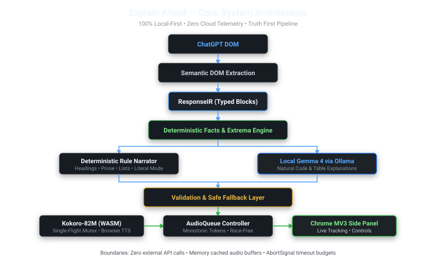
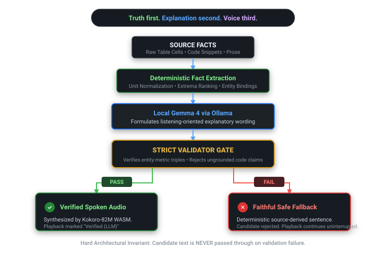

# Explain Aloud: Don't Read the Screen to Me. Explain It to Me.

## What I Built

Explain Aloud is a Chrome extension that turns structured ChatGPT responses into natural audio explanations you can follow without looking at your screen.

I built this for my girlfriend. She regularly uses AI assistants and built-in "Read Aloud" features while multitasking away from her screen. The core problem is that when an AI generates structured content—like code snippets, tables, bulleted lists, and visual references—it becomes exceptionally difficult to understand through ordinary listening. 

Standard text-to-speech tools read screens linearly. They flatten two-dimensional tables into robotic cell lists and turn concise code blocks into an avalanche of syntactic noise. Explain Aloud solves this by deconstructing the AI response, using an open model (Gemma 4 via local Ollama) to rephrase structures for audio comprehension, and speaking the verified result through Kokoro in the browser.

## Demo

*(Insert REAL screenshot of a ChatGPT response containing structured content here)*

*(Insert REAL screenshot of the Explain Aloud Chrome side panel while narration is playing, showing Natural Mode segments and source provenance)*

When you trigger Explain Aloud on a ChatGPT response:
- **Headings** become natural conversational transitions.
- **Lists** flow with rhythmic speech cadence.
- **Code snippets** are explained by what they accomplish rather than literal punctuation soup.
- **Comparison tables** are analyzed row-by-row, extracting facts deterministically before wording is chosen.

## Code

- **Repository**: [explain_aloud on GitHub](https://github.com/adarshsingh/explain_aloud)
- **Local Model Configuration**: Gemma 4 via Ollama
- **Audio Synthesis**: Kokoro.js (WebAssembly)

## How I Built It

### The Core Principle

The architecture was built on three non-negotiable principles:
1. **Truth first.**
2. **Explanation second.**
3. **Voice third.**

Rather than shoveling raw HTML straight into a voice synthesizer, or blindly asking an LLM to write a script, Explain Aloud divides work between deterministic rules and local AI.


*End-to-end dataflow: from ChatGPT DOM extraction to typed ResponseIR, deterministic fact extraction, bounded Gemma semantic narration, safety validation, and Kokoro TTS.*

### The Trust Boundary

An AI explanation must never sacrifice factual truth for conversational polish. If the voice confidently misattributes a metric from a table, the listener walks away with false information.


*Truth first, explanation second, voice third. Gemma is allowed to choose explanatory phrasing, but facts are deterministically extracted beforehand.*

To support this, `tableEngine.ts` parses rectangular grids deterministically to extract entities, numeric values, and normalized units. 

Gemma's job is load-bearing: it helps produce listening-oriented "Natural" narration. But it is heavily constrained. The deterministic logic extracts the facts first, and Gemma is prompted to word them cleanly.

### The test suite was green. The contract wasn't.

The central engineering challenge of Explain Aloud wasn't just getting Kokoro to speak or Gemma to generate text. It was enforcing the trust boundary. 

My automated test suite was green. The parsers extracted the right tables. The UI rendered the right buttons. But when subjected to adversarial review, the underlying assumptions broke down. The tests verified that data moved from point A to point B, but they missed the semantic contract. 

What if Gemma hallucinates a reversed comparison, saying Model B is faster when it's slower? What if it invents numbers?

This led to the creation of the Segment Validator and its strict fallback contract. Every candidate narration segment produced by Gemma must pass through `segmentValidator.ts`.

If a candidate fails validation, Explain Aloud drops the generated text and immediately dispatches a source-derived deterministic fallback:

```typescript
// Validation FAILED -> generate safe deterministic source-derived fallback
let fallbackText: string;
let fallbackProvenance: 'rule' | 'literal' = 'literal';

if (sourceBlock.type === 'table') {
  fallbackText = generateDeterministicTableSummary(sourceBlock);
  fallbackProvenance = 'rule';
} else if (sourceBlock.type === 'code') {
  const structured = sourceBlock.structured as CodeStructured | undefined;
  fallbackText = formatLiteralCode(structured?.code || sourceBlock.raw, structured?.language || 'code');
  fallbackProvenance = 'literal';
}

return {
  valid: false,
  reasons,
  validatedSegment: {
    id: `${segment.id}-fallback`,
    sourceBlockIds: [sourceBlock.id],
    factIds: [],
    provenance: fallbackProvenance,
    text: fallbackText,
    verified: false,
    fallbackReason: `Validation failed: ${reasons.join(', ')}`,
    pauseAfterMs: 350,
  },
};
```

This ensures playback continues uninterrupted and truth is preserved.

### Hardening and Verification

The final implementation passed 191 tests across 14 files, ensuring the pipeline holds up against edge cases like nested lists, Python language markers, and tricky unit normalization (e.g., distinguishing lowercase `kb` from uppercase `kB`). 

### Honest Limitations

Building this MVP surfaced realities about running local multimodal AI in the browser:
- **Scope**: The MVP supports only ChatGPT completed assistant responses. Complex visual math, SVG diagrams, and Mermaid charts currently fall back to literal or generic summary descriptions.
- **Latency**: Local Gemma inference and Kokoro WASM initialization carry a noticeable cold-start delay. Actual browser timings depend heavily on the user's physical machine and local environment.
- **Validation Limits**: The current validator checks specific factual constraints and entity matching; it is a heuristic safety net, not a formal semantic proof system. Universal semantic faithfulness is not claimed.
- **Fallback**: On unsupported structures or LLM timeouts, the system acts conservatively and falls back to deterministic rules.

## Why Does Open Innovation Matter?

Open models make it possible to build local-first workflows without paying API tolls or sending conversations to the cloud. Explain Aloud proves that a specialized on-device model can do something uniquely powerful—translating screens into speech—while operating within a browser extension sandbox alongside Kokoro WASM.

## My Agent Session

*(Insert Forem Liquid Tag for agent session here, if applicable)*

## Prize Categories

*(List applicable prize categories/tracks here)*

---

Returning to the original question that sparked this project for my girlfriend: *"Can the listener understand the answer without looking at the screen?"*

By forcing the system to respect truth first, explanation second, and voice third, Explain Aloud gives listeners their eyes back.
