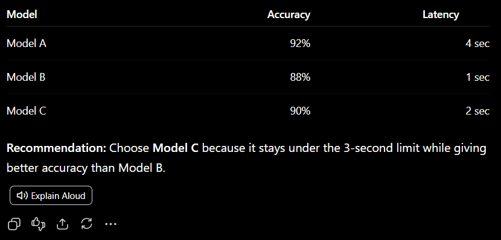
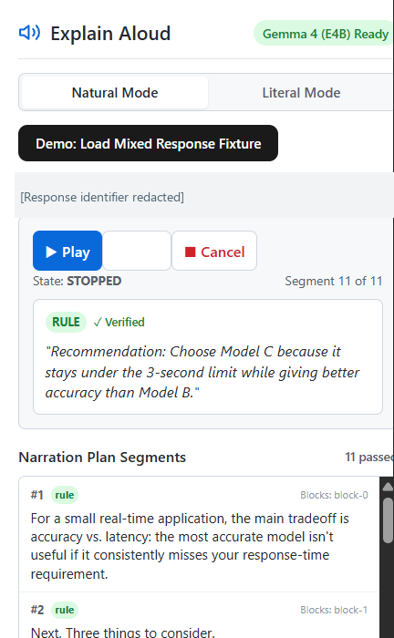
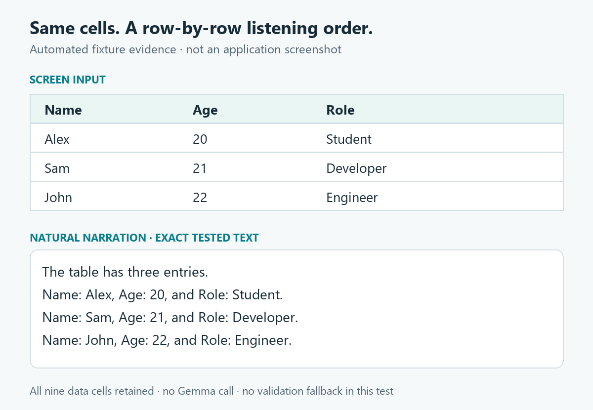

# Explain Aloud: keeping the structure when a ChatGPT answer becomes speech

With less than an hour before a lecture, I was still fixing the parts of Explain Aloud that a listener would notice immediately. A Python block was arriving as “plaintext.” A three-person table sounded like a ranking exercise. A heading became “Next, small List.”

Actual speech was already working. These were problems in what the extension was preparing to say.

That distinction is the reason for Explain Aloud: turn a structured ChatGPT response into an explanation someone can follow without looking at the screen. Headings, code, and tables need different treatment before they reach the voice.



*The extension attaches its action to a completed response. These model figures are example response content, not measurements of Explain Aloud.*

## The answer becomes a plan you can inspect

Explain Aloud extracts the selected response into typed blocks, builds a narration plan, and sends its segments to Kokoro for speech. The Chrome side panel holds the listening controls and an inspector: each segment has its own source references and provenance.

Natural Mode can ask local Gemma to explain code or word table facts. Literal Mode takes the deterministic narration path. Simple prose, headings, lists, and the newly supported small-table path do not need a model to rewrite them.



*The captured panel is stopped, with a rule-generated segment selected. The Ready badge reports model availability; it does not establish which model generated an earlier segment. The response identifier has been visibly redacted.*

The green “Verified” label is the application's validation result. It is not a claim that a semantic proof was performed. Keeping the inspector visible makes that distinction discussable instead of hiding the narration behind a play button.

## Where Gemma participates

The boundary I wanted was concrete: parse table values in code, then give the model those facts when wording needs help. Gemma receives the source code for code explanations and the extracted facts for table explanations. Its output is a candidate narration, not the source of truth.


*The queue requests synthesis from Kokoro and manages playback. Ollama is the local model service; there is no additional application backend or database in this path.*

The narration segment type preserves the boundary between text, evidence, and voice:

```ts
export interface NarrationSegment {
  id: string;
  sourceBlockIds: string[];
  factIds: string[];
  provenance: Provenance;
  text: string;
  verified: boolean;
  fallbackReason?: string;
  pauseAfterMs: number;
}
```

`Provenance` is `rule`, `llm`, or `literal`. Source and fact references let validation check candidates against the selected response. Rejected candidates use a source-derived fallback; generation errors have fallback paths too. Those guardrails catch tested cases, but they do not establish correctness for every possible answer.

The configured default is `gemma4:e4b`, with `gemma4:e2b` as the model-not-found fallback. I have not recorded the model identity for the final browser generation, so I am not presenting the Ready badge as that evidence.

## A small table should not become a leaderboard

One final demo example had three columns: Name, Age, and Role. The previous deterministic summary started by describing comparisons and highest/lowest ages. That preserved facts, but it put emphasis on a ranking the listener had not asked for.

For complete rectangular tables with two to four rows and two to four columns, the final patch uses row-wise wording. It retains the headers and values instead of guessing additional relationships. Larger or irregular tables keep the existing path.



*This is an evidence graphic, not a browser screenshot. Its narration is copied directly from the passing regression assertion, including the repeated header labels.*

The exact output begins: “The table has three entries. Name: Alex, Age: 20, and Role: Student.” It continues with Sam and John in the same form. The test checks the complete text, confirms that Gemma is not called, and checks that the plan does not fall back during validation.

The language fix followed the same restraint. Python is preserved when ChatGPT exposes it through a code class, data attribute, or nearby language header. An unmarked `print(...)` is not enough to guess Python. Seven fixture variants cover explicit markers, including a Python header beside a generic plaintext class. “Copy code” stays out of the narrated content.

## The build passed; Chrome still could not speak

Before those listening improvements, there was a more basic failure in the production extension:

```text
no available backend found
[wasm] TypeError: Failed to fetch dynamically imported module
```

Kokoro's underlying runtime was trying to import its JavaScript module from a CDN. The production build had succeeded, but that did not mean the extension could initialize the speech backend.

The fix was to bundle the matching ONNX Runtime `.mjs` and `.wasm` assets and configure their local URLs before loading the model:

```ts
env.wasmPaths = {
  mjs: new URL(ortModuleUrl, globalThis.location.href).href,
  wasm: new URL(ortWasmUrl, globalThis.location.href).href,
};
```

The packaged files matched the installed runtime files by SHA-256. After reloading the extension, I confirmed actual Kokoro speech in Chrome. That was a browser result, separate from the earlier green build.

## What the evidence establishes

| Check | Recorded result | Boundary |
|---|---|---|
| Automated suite | 191 tests passed across 14 files | Fixture and regression coverage, not a universal faithfulness guarantee |
| TypeScript | `tsc --noEmit` passed | Static checking |
| Production build | Chrome MV3 build passed; 24.11 MB | Packaging; a large-chunk warning remains |
| Real Chrome | Production extension manually tested; actual Kokoro speech confirmed | Developer-reported listening result; screenshots separately show the running UI |
| Playback controls | Pause, resume, skip, and cancel queue tests pass | Individual final browser outcomes were not separately recorded |

First narration still needs measurement. Local console instrumentation records extraction, plan construction, Gemma generation, validation, Kokoro initialization, per-segment synthesis, and click-to-first-audio. There is no recorded final browser timing breakdown, so there is no latency graph here.

## The demo and its limits

The useful demonstration is short: select a completed mixed response, show the resulting narration segments, listen, and use the playback controls. The two Chrome captures above show the real response and panel. A recorded video with audible playback is not included in this draft.

The MVP targets completed ChatGPT responses containing prose, headings, lists, code, and tables. It is not a screen-reader replacement. Browser DOM changes remain a risk. Validation is heuristic, and passing the current fixtures does not eliminate unsupported narration on other inputs.

Narration requests go to local Ollama and speech synthesis uses local Kokoro WASM. Complete offline operation has not been verified. The original ChatGPT conversation also remains a ChatGPT conversation; this extension does not change that service's privacy boundary.

The last pre-demo changes were deliberately small: keep Python's explicit label, speak a small table one row at a time, preserve technical names while smoothing ordinary headings, and measure the wait before trying to optimize it. Those changes bring the project closer to the listening experience it was built for: following the answer without having to keep reconstructing its layout in your head.

*Draft prepared with AI assistance from the repository, recorded verification results, and real application captures. Author review is still required before publication.*
